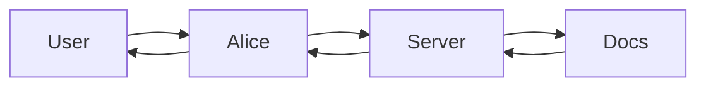

# Alice-applicants

## 1. Контекст проекта

### 1.1 Бизнес-задача
	•	Проблема/вызов
		1) Иностранные абитуриенты сталкиваются с большим количеством разрозненной информации: правила поступления, списки документов, дедлайны, языковые 					требования, подача заявки, стоимость, визовые/миграционные базовые вопросы.

		2) Команды приёмной комиссии/поддержки получают много повторяющихся вопросов, особенно в пиковые периоды (подача документов, дедлайны, публикация 					результатов).

		3) Из-за языкового барьера и часовых поясов ответы «человеком» не всегда доступны быстро.
			
	•	Почему чат-бот / RAG имеет смысл

		1) Контент в основном фактический и документированный хорошо искать по официальным источникам.

		2) RAG убирает лишнее обдумывание ответа: бот отвечает на основе найденных фрагментов и может давать ссылку на первоисточник.

		3) Легче поддерживать актуальность: обновили документы и бот автоматически ссылается на обновленный документ.
		
	•	Каковы критерии успеха с точки зрения бизнеса.

		1) Доля решённых обращений без участия человека.

		2) Скорость ответа.

		3) Снижение повторных обращений по одной и той же теме.

### 1.2 Целевая аудитория и пользователи
	•	Кто будет пользоваться ботом: внутренние сотрудники, клиенты, партнёры:
		Иностранные абитуриенты (бакалавриат/магистратура), иногда — родители.
		
	•	Какие сценарии использования: текстовый чат, голосовой интерфейс, мессенджеры, веб-виджет.
		1) Основной: голосовой (навык Алисы).
		2) веб-чат с Алисой.
		
	•	Какова предполагаемая нагрузка: число сессий/пользователей, пиковые часы.
		100-200 сессий в день.
		в основном нагрузка в летний период и в начале сентября, пока абитуриенты активно изучают информацию о ВУЗе.

### 1.3 Ограничения и допущения
	•	Что нельзя/не будет делать (например: не интегрируемся с X, не обрабатываем Y).
		1) Не принимаем решения “пройдёте/не пройдёте”, не оцениваем шансы.

		2) Не даём юридические советы по визам/миграции (только общие шаги + официальные ссылки).

		3) Не интегрируемся в сторонние сервисы и сайты.

		4) Не нарушает правила ВУЗа и законы РФ.
		
	•	Предположения о данных, инфраструктуре, требованиях к безопасности, к нормативам.
		1) Основной источник знаний — официальные документы ВШЭ.

		2) Бот работает в рамках предметной области “поступление”. На оффтоп отвечает мягким отказом и предлагает доступные темы.

		3) Главный риск — устаревшая информация, поэтому должны быть ссылки на первоисточники, дата обновления базы, экстренное сообщение - “обратитесь в приёмную 		комиссию”.

## 2. Архитектура решения

### 2.1 Общая схема
	•	Диаграмма архитектуры: фронт-энд (чат-интерфейс) → API → RAG-движок → база/хранилище знаний → LLM → пост-обработка.

	•	Основные компоненты и их роли.
		1) База знаний: • HTML/PDF/текст с официальных страниц ВШЭ.
						• Индекс для поиска (чтобы быстро находить релевантные куски): векторный индекс (и/или ключевой).
			БД: 1) голые файлы (хранятся на облаке/диске)
				2) индекс (с помощью докера)
		2) Промпты в репозитории.

	• Когда мы стучимся в БД:

		1) Пришёл запрос от Алисы → сервер его принял.

		2) Быстрая проверка: это приветствие/помощь/смена языка/контакты? → отвечаем без БД или это типовой вопрос из FAQ (жёстко прописанные ответы)? → отвечаем 			без БД

		3) Если вопрос “про поступление” и не очевидный: запрос → индекс → топ фрагментов.

			Если фрагменты найдены и релевантны → генерируем ответ.

			Если не нашли / низкая уверенность → уточняем или даём контакты/ссылку.

	• В каком порядке обрабатываем пользовательские запросы:
	1) Получение запроса
	2) нормализуем текст
	3) Определение языка
	4) анализ вопроса
	5) поиск информации если вопрос по теме
	6) собираем ответ из кусков 
	7) постобработка
	8) ответ

### 2.2 Хранилище знаний / документооборот
	•	Источники знаний: внутренние документы, база знаний, Wiki, чаты, внешние API.
	
		Официальные страницы: правила приёма, описания программ, контакты, дедлайны.
		Документы: PDF/HTML регламенты, чек-листы документов, инструкции.
		
	•	Предобработка: парсинг, нормализация, категоризация.
	
		парсинг: Ручное обновление и извлечение информации из источников.
    	нормализация: ручная нормализация, перевод на английсий язык.
		
	•	Индексация: векторизация (embedding), ключевые слова, метаданные.
	
		Ключевые слова: Голосовой помощник, Алиса, Яндекс.Диалоги, Aimylogic, абитуриенты, ВШЭ, поступление, навык, тестирование, no-code разработка.
		
	•	Обновление данных: как часто синхронизируется, как обрабатываются новые документы.

		- Ручное обновление базы знаний по мере необходимости: в начале каждого семестра и при появлении официальных новостей/объявлений от вуза. Источники хранятся в виде сырых     документов (HTML/PDF) в doc-store и очищенных текстовых чанков в формате JSON. Для поиска используется векторный индекс, размещённый в отдельном сервисе   и содержащий метаданные. Обновление реализовано пайплайном парсинг → очистка → чанкинг → переиндексация, который может работать         инкрементально (только изменившиеся документы) либо полной пересборкой индекса.

Как часто обновляем данные? Где храним? Что храним? в каком виде? Где оно лежит, если нужно будет обновить? (Парсинг или ручное обновление)

### 2.3 Retrieval + Generation
	•	Retrieval: какой движок (Qdrant, FAISS, Elastic Vectorembedding и т.д.), конфигурации (embedding модель, размер векторов, k, threshold).

		Qdrant
	
	•	Generation: какая LLM используется (локально / облако), с какими промпт-шаблонами.

		Промпт-шаблон: “Отвечай только по контексту, если нет ответа — скажи, что не нашёл, и предложи официальный контакт.”

	•	Контроль ответа: фильтрация, шаблоны, гарантия качества, fallback стратегия.
		Если нет релевантных источников: "уточните на следующих сайтах."
		уточняющий вопрос (“Вы про бакалавриат или магистратуру?”) или “не нашёл в базе” + ссылка на раздел/контакты.
		Ограничение длины (для голоса): кратко + “могу подробнее”.

### 2.4 Интеграции и интерфейсы
 	• Внешние API и сервисы: 
	
    - чат-интерфейс: Платформа Яндекс Диалоги (API Яндекс Алисы).
    - Логирование: Встроенные средства Яндекс Диалогов для базового логирования запросов и ответов.
    - база пользователей и CRM: Бот является полностью анонимным. История диалога не сохраняется между сессиями.
	
	•	Протоколы: REST, gRPC, WebSockets, Webhook.
	•	UI/UX: как выглядит чат, переходы, кнопки, предложения.
	•	Мониторинг: логирование запросов/ответов, аналитика, алерты.

### 2.5 Инфраструктура и развертывание
	•	Архитектурный стек: контейнеры (Docker), оркестрация (Kubernetes), серверless.
	•	Среды: dev/test/prod.
	•	Требования к вычислениям: GPU или CPU, память, хранилище.
	•	Безопасность: аутентификация, авторизация, шифрование, GDPR/нормы.
	•	Масштабирование: горизонтальное, резервирование, локализация.

## 3. Данные и качество знаний

Пометка: содежат ли документы чувствительные данные (можно ли это отправлять "во вне", например, в GPT, или можно только локальные модели; может быть придётся замаскировать данные?)

### 3.1 Сбор и предобработка данных
	•	Источники документов/текста, форматы (PDF, HTML, TXT, базы данных).
	
		HTML страницы, PDF регламенты, TXT/Docx (если есть внутренние материалы, но для иностранцев лучше держаться официальных публичных).
		
	•	Шаги предобработки: токенизация, очистка, выделение сущностей, сегментация.

		Очистка, разметка заголовков, chunking, языковая метка.
		
	•	Метаданные: добавление тегов, категоризация, дата, автор.
		URL, дата обновления, год набора, язык, категория (документы/дедлайны/стоимость/контакты).

### 3.2 Векторизация и индексирование
	•	Модель embedding: название, версия, особенности (например multiling, domain-specific).
	•	Параметры индекса: размер, алгоритм, метрики (cosine, euclid), shards/replicas.
	•	Стратегии обновления: инкрементальное обновление, пересборка индекса.

### 3.3 Метрики качества знаний
	•	Покрытие: % документов в базе относящихся к сценариям.
	•	Актуальность: как быстро база обновляется, как отражаются изменения.
	•	Консистентность: нет дубликатов, нет противоречивых данных.
	•	Проверка: ручная ревизия, спотыкаемые примеры, A/B-тестирование.

## 4. Модель и генерация

### 4.1 Выбор LLM и промптинг
	•	Указание модели: объяснение, почему выбранa.
	•	Промпт-шаблоны: входные данные, контекст, инструкции, формат ответа.
	•	Ограничения: максимальная длина, токены, скорость генерации.

### 4.2 Контроль качества ответов
	•	Метрики: точность, полнота/coverage, полезность, удовлетворённость пользователя.
	•	Оценка ошибок: нежелательные ответы, hallucinations, офтопик.
	•	Механизмы: ручной ревью, эвристики (например “если confidence < x, дефолтный ответ”), fallback на статический контент.

### 4.3 Обучение/дообучение
	•	Если предусмотрено fine-tuning или RLHF: данные, процесс, метрики.
	•	Версионирование моделей, rollback план.

## 5. UX / пользовательский опыт

Важно: пункт 5.1 -- он определяет частично БФТ. Что делать, если не смогли ответить? Продумать, где мы можем накосячить и как это обработать?

### 5.1 Сценарии взаимодействия
	•	Основные сценарии: приветствие, поиск по знаниям, уточняющий вопрос, многотуровый диалог.
	•	Исключительные сценарии: нет ответа, не поняли, баг, перенос к оператору.

### 5.2 Диалоговая логика
	•	Как обрабатываются состояния: single-turn, multi-turn.
	•	Как ведётся контекст: окно истории, память пользователя.
	•	Как эстетически выглядят ответы (тон, стиль, язык, эмодзи/микроинтеракции).
Храним ли мы историю общения с пользователем? Если да, то как? В каком тоне отвечаем?

### 5.3 Метрики UX
	•	Время до первого ответа, % возврата пользователей, NPS, рейтинг полезности ответа.
	•	Логирование взаимодействий, сбор отзывов.
Как быстро нужно отвечать? Может быть надо как-то взаимодействовать с пользователем в рамках получения фидбэка (лайк/дизлайк). Нужно ли логгировать работу бота для отслеживания качества работы?

## 6. Безопасность, соответствие и этика
	•	Обработка персональных данных, разрешения пользователей.

		Не запрашивать паспорт/адрес/номер документа.
		Если пользователь сам прислал — не сохранять в логах (маскирование).

	•	Устранение вредоносного/нежелательного контента, фильтры.

		Офтоп/токсичность → отказ + возврат к теме поступления.
		
	•	Прозрачность: уведомление о том, что это бот, логика сбора данных.

		Сообщать: “Я бот, отвечаю по официальным источникам. В сложных случаях — контакт приёмной комиссии.”
		
	•	Регулирования и нормативы (GDPR, внутренние политики).
	
		Соблюдаем принципы минимизации данных, не запрашиваем чувствительные персональные данные, логируем только обезличенную техническую информацию, а в спорных вопросах даём ссылку на официальный источник и контакт приёмной комиссии.

## [OPTIONAL] 7. План внедрения и эксплуатации

Скорее актуально для рабочего проекта и его запуска.
### 7.1 Этапы проекта
	•	Фаза 0: исследование/документирование.
	•	Фаза 1: MVP (минимально жизнеспособный бот).
	•	Фаза 2: расширение функциональности, RAG-дополнения.
	•	Фаза 3: масштабирование, оптимизация.
	•	Вехи, сроки, ответственные.

### 7.2 Поддержка и эксплуатация
	•	Кто отвечает за поддержку (SRE, DevOps, чат-бот команда).
	•	Мониторинг: логирование ошибок, SLA, alerts, dashboards.
	•	Обновление знаний: план синхронизации, процесс ревью.
	•	Метрики эксплуатации: uptime, latency, cost per session.

## 8. Риски и допущения
	•	Список основных рисков (например: модель даёт неточные ответы, база знаний недостаточна, бюджет/ресурсы ограничены).
	•	Вероятность и влияние, стратегия уменьшения (mitigation).
	•	Ключевые допущения, которые не проверены.

## 9. [OPTIONAL] Бюджет и ресурсы
Скорее актуально для рабочего проекта и его запуска.
	•	Человеческие ресурсы: ML инженер, NLP инженер, DevOps, UX дизайнер, контент-менеджер.
	•	Технологические ресурсы: вычислительные ресурсы (GPU/CPU), лицензии, облачные сервисы.
	•	Примерные затраты (CAPEX, OPEX).
	•	ROI оценки: ожидаемое снижение затрат, ускорение ответа, рост удовлетворённости.

## 10. Приложения
Что-то, что стоит прописать в тексте работы во введении.
	•	Словарь терминов и аббревиатур.
	•	Ссылки на специфические документы: требования безопасности, регламент, UX-гайд, API-спецификации.
	•	Диаграммы, схемы, mock-up интерфейсов.
	•	Чек-лист готовности к запуску.
